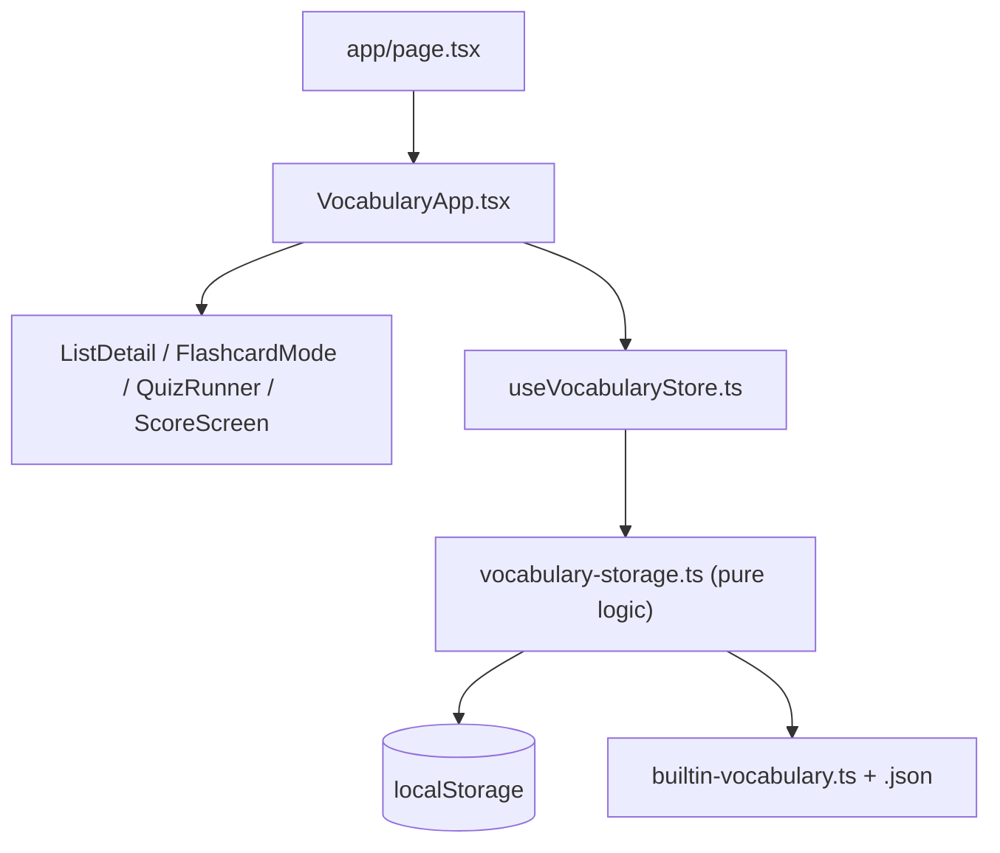
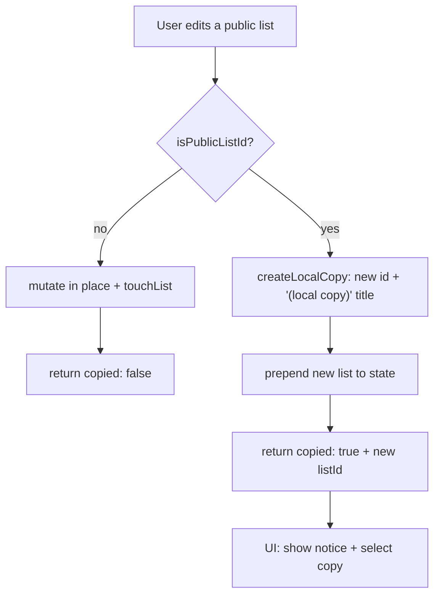
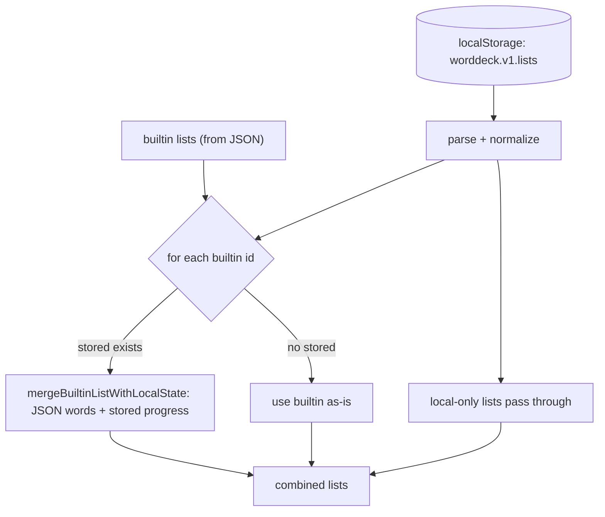
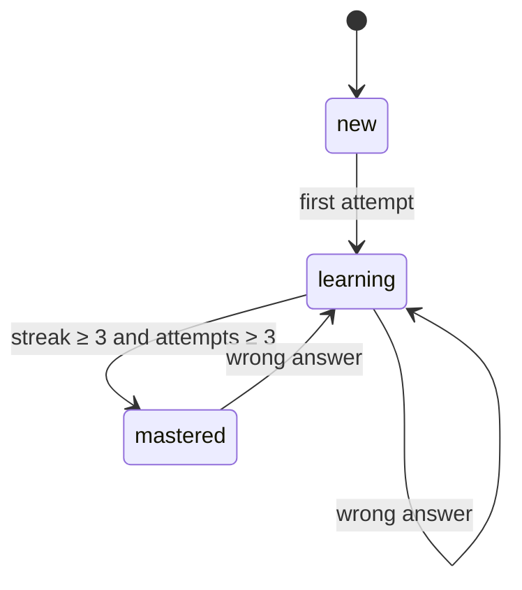
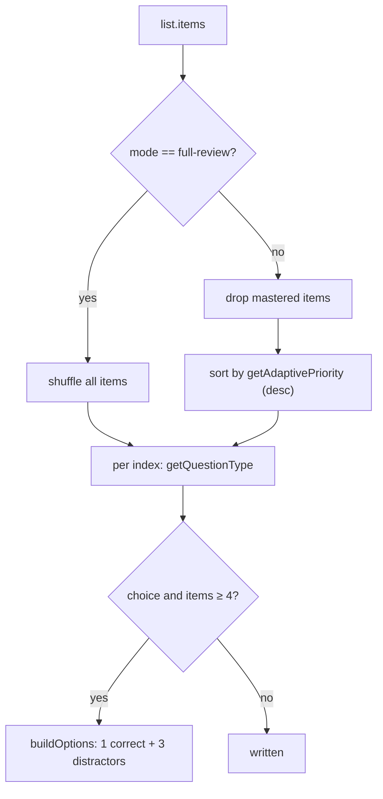

# Architecture

A deep dive into how AJ Words is structured: the data model, where state lives, the
non-obvious flows (builtin lists, copy-on-write, progress merging), the quiz engine,
and the PWA layer. For a quick start and feature overview see the
[README](../README.md); for contributor/agent conventions see [CLAUDE.md](../CLAUDE.md).

## Contents

1. [Overview and principles](#1-overview-and-principles)
2. [Layered architecture](#2-layered-architecture)
3. [Data model](#3-data-model)
4. [State and persistence](#4-state-and-persistence)
5. [Builtin lists and copy-on-write](#5-builtin-lists-and-copy-on-write)
6. [List load and progress merge](#6-list-load-and-progress-merge)
7. [Progress and mastery](#7-progress-and-mastery)
8. [Quiz engine](#8-quiz-engine)
9. [Flashcards](#9-flashcards)
10. [Import and export](#10-import-and-export)
11. [PWA and service worker](#11-pwa-and-service-worker)
12. [Component map](#12-component-map)
13. [Configuration notes](#13-configuration-notes)

---

## 1. Overview and principles

AJ Words is a **fully client-side** vocabulary-learning PWA built on Next.js 16 (App
Router), React 19, and TypeScript (strict). There is **no backend, no database, and no
API routes** — every byte of user data lives in the browser's `localStorage`.

The whole app is one route. [`app/page.tsx`](../app/page.tsx) renders a single client
component, [`components/VocabularyApp.tsx`](../components/VocabularyApp.tsx), which owns
all view state via a `view` enum (`home` · `list` · `flashcards` · `quiz` · `score`) and
orchestrates every child component. The `@/*` import alias maps to the repo root
(`tsconfig.json`).

Guiding constraints:

- **Data logic is centralized and pure.** All normalization and progress math lives in
  [`lib/vocabulary-storage.ts`](../lib/vocabulary-storage.ts), a framework-free module.
  Components never read or write `localStorage` directly for vocabulary data — they go
  through the [`useVocabularyStore`](../lib/useVocabularyStore.ts) hook.
- **Status is derived, never trusted.** A word's `new`/`learning`/`mastered` status is
  always recomputed from its counters; stored status is only an output.
- **Bundled lists are shared and read-only**, with copy-on-write on first edit (see
  [§5](#5-builtin-lists-and-copy-on-write)).

## 2. Layered architecture

- **UI layer** — `VocabularyApp` plus the view/modal components in `components/`.
- **Store layer** — `useVocabularyStore` holds the React state, hydrates on mount, and
  autosaves on change. It exposes intent-level mutators (`addWord`, `updateList`,
  `recordQuizProgress`, …) and never leaks `localStorage` details upward.
- **Storage layer** — `vocabulary-storage.ts` is pure functions over plain objects:
  load/save, normalization, progress math, export/import payloads.
- **Seed data** — `builtin-vocabulary.ts` compiles the bundled
  `builtin-vocabulary-data.json` into typed `WordList`s.

## 3. Data model

All types are defined in [`types/vocabulary.ts`](../types/vocabulary.ts).

| Type | Key fields | Notes |
| --- | --- | --- |
| `WordList` | `id`, `title`, `language?`, `items[]`, `testHistory[]`, `createdAt`, `updatedAt` | Top-level container. |
| `VocabularyItem` | `id`, `word`, `translation`, `status`, `attempts`, `correctCount`, `wrongCount`, `correctStreak`, `wrongStreak`, `lastTestedAt?`, `lastWrongAt?`, `createdAt`, `updatedAt` | `status` is `new \| learning \| mastered`, always derived. |
| `TestHistoryEntry` | `id`, `mode`, `attempts[]`, `correctCount`, `total`, `score`, `createdAt` | One completed quiz; `score` is a 0–100 percentage. |
| `QuizAttempt` | `itemId`, `questionType`, `prompt`, `correctAnswer`, `userAnswer`, `isCorrect`, `options?` | `questionType` is `written \| choice`; `options` only for choice. |
| `ListProgress` | `total`, `mastered`, `learning`, `fresh` | **Derived** (via `getProgress`), never stored. |

`QuizMode` is `written | choice | mixed | test | full-review`.

### LocalStorage keys

| Key | Shape | Written by |
| --- | --- | --- |
| `worddeck.v1.lists` | `WordList[]` — every list, including local copies and the progress overlay for builtin lists | `saveLists` (via the store) |
| `ajwords.v1.ui` | `{ selectedListId }` — last opened list (also mirrored to the `?list=` URL param) | `VocabularyApp` |
| `ajwords.v1.flashcards` | `{ [listId]: { nextIndex, updatedAt } }` — per-list flashcard resume position | `VocabularyApp` |

## 4. State and persistence

[`useVocabularyStore`](../lib/useVocabularyStore.ts) is the single source of truth for
list data:

- **Hydrate on mount** — an effect calls `loadLists()` once and sets `hydrated`.
- **Autosave on change** — a second effect calls `saveLists(lists)` whenever `lists`
  changes (guarded by `hydrated` so the initial empty state doesn't clobber storage).
- **Intent-level mutators** — `addList`, `updateList`, `deleteList`, `addWord`,
  `updateWord`, `deleteWord`, `recordQuizProgress`, `recordFlashcardProgress`,
  `addTestHistory`, `importLists`. The mutators that can touch a builtin list return
  `{ copied: boolean, listId }` so the UI can react to a copy-on-write fork.

`VocabularyApp` keeps the remaining **UI** state (current view, selected list, modal
state, in-flight quiz attempts) and manages the two UI-only `localStorage` keys directly
through small helpers (`readPreferredListId`/`writePreferredListId`,
`readFlashcardPosition`/`writeFlashcardPosition`).

## 5. Builtin lists and copy-on-write

This is the central non-obvious concept. The app ships ~22 pre-seeded lists (Darija +
Hebrew Quizlet units) in
[`lib/builtin-vocabulary-data.json`](../lib/builtin-vocabulary-data.json), compiled into
typed `WordList`s by [`lib/builtin-vocabulary.ts`](../lib/builtin-vocabulary.ts). These
are treated as **shared / read-only**:

- `isPublicListId` (= `isBuiltinListId`) gates every place a list could be mutated.
- A builtin list **cannot be deleted**, and any edit to it (rename, add/edit/delete a
  word) does **not** mutate it. Instead the store calls `createLocalCopy` to fork a
  brand-new local list — fresh `id`, title suffixed `" (local copy)"` — and switches the
  user to it.
- Every affected mutator returns `{ copied, listId }`; when `copied` is `true`,
  `VocabularyApp` selects the new list and shows a "Created a local copy…" notice.

The same rule applies on **import**: an incoming list whose `id` matches a builtin id is
turned into a local copy rather than overwriting the shared definition (see
[§10](#10-import-and-export)).

## 6. List load and progress merge

Word **content** for builtin lists always comes from the bundled JSON, but a user's
**progress** on those words must survive reloads. `loadLists` reconciles the two:

- `mergeBuiltinListWithLocalState` rebuilds each builtin list from its canonical JSON
  items, then overlays the stored per-item counters/status/timestamps where the item id
  matches. Words added or removed in the JSON therefore win; the user's stats follow
  along by id.
- Local (non-public) lists are returned verbatim.
- The result is `[...publicLists, ...localLists]`.

> **Maintenance note:** the runtime path (`vocabulary-storage.ts` `normalize*`) and the
> two build-time paths ([`builtin-vocabulary.ts`](../lib/builtin-vocabulary.ts) and the
> CLI [`scripts/import-phone-export.mjs`](../scripts/import-phone-export.mjs))
> independently parse and validate the same shapes. Change one and you almost certainly
> need to change the others.

## 7. Progress and mastery

A word's `status` is **always derived** by `deriveLearningStatus`, never read from input:

- `attempts <= 0` → `new`
- `wrongStreak > 0` → `learning`
- `correctStreak >= MASTERED_STREAK (3)` **and** `attempts >= MIN_MASTERED_ATTEMPTS (3)`
  → `mastered`
- otherwise → `learning`

Two functions apply outcomes and then re-derive status:

- **`applyAttemptsToItems`** — folds a batch of `QuizAttempt`s onto the matching items
  (increment attempts, bump correct/wrong counts and streaks, set timestamps).
- **`applyFlashcardAssessmentToItems`** — applies a single swipe. A `mastered` swipe
  ratchets the counters up to at least the mastery thresholds so one decisive swipe can
  mark a word mastered; a `learning` swipe records a miss.

Completed quizzes are also appended to `list.testHistory`, **capped at the 30 most recent
entries** (`addTestHistory` slices to 30).

## 8. Quiz engine

[`components/QuizRunner.tsx`](../components/QuizRunner.tsx) builds a session up front with
`buildQuestions(list, mode)`:

- **Selection (`getSessionItems`)** — `full-review` shuffles everything; all other modes
  drop already-mastered words (falling back to the full set if none remain) and order
  the rest by `getAdaptivePriority`, which ranks items by wrong streak, recency of
  mistakes, and learning state so weak words come first.
- **Question type (`getQuestionType`)** — `written` is always written; `choice` is
  multiple-choice when possible; `mixed`/`test` alternate by index. Multiple choice
  requires at least 4 items in the list (`canUseChoice`), otherwise it falls back to
  written.
- **Options (`buildOptions`)** — the correct translation plus up to 3 unique distractors
  drawn from other items, shuffled, capped at 4.
- **Grading** — answers are compared after `normalizeAnswer` (trim, lowercase, collapse
  internal whitespace).

On finish, `VocabularyApp` calls `recordQuizProgress` (updates word stats) and
`addTestHistory` (logs the attempt), then shows
[`ScoreScreen`](../components/ScoreScreen.tsx) — score ring, "frequent errors / still
learning / mastered now" insights, correct/mistake lists, a full per-question review, and
a words-to-review list.

## 9. Flashcards

[`components/FlashcardMode.tsx`](../components/FlashcardMode.tsx) is a pointer-driven
swipe deck:

- **Swipe right → `mastered`, swipe left → `learning`** (threshold `SWIPE_THRESHOLD`),
  with the same outcomes available as buttons. Tapping flips the card.
- Each assessment calls back into `recordFlashcardProgress`.
- The **resume index** is persisted per list under `ajwords.v1.flashcards` and restored
  when the mode is entered, so a long deck can be studied across sessions.
- Honors `prefers-reduced-motion` (skips the exit animation delay).

## 10. Import and export

There are **three distinct** data paths — don't conflate them:

1. **In-app JSON export/import** — `createExportPayload` writes a file tagged
   `app: "aj-words", version: 1`; `parseExportPayload` validates that tag/version on
   import and normalizes every list. Importing an id that matches a builtin list forces a
   local copy. Driven from the Export/Import buttons in `VocabularyApp`.
2. **Quizlet paste** — [`lib/vocabulary-import.ts`](../lib/vocabulary-import.ts) parses
   tab-separated `word⇥translation` lines (used when creating/editing a list).
3. **CLI seed regeneration** — `npm run import:phone -- <export.json>` runs
   [`scripts/import-phone-export.mjs`](../scripts/import-phone-export.mjs), which takes an
   in-app export and rewrites `lib/builtin-vocabulary-data.json`. This is how the bundled
   starter lists are refreshed from a real device.

## 11. PWA and service worker

- [`app/manifest.ts`](../app/manifest.ts) is a Next metadata route served at
  `/manifest.webmanifest` (name, icons, standalone display, theme colors).
- [`public/sw.js`](../public/sw.js) is the service worker (cache name `aj-words-v2`).
  Strategies by request:
  - **navigation** → network-first, falling back to the cached `/` shell when offline;
  - **`/icons/*` and `/apple-touch-icon.png`** → stale-while-revalidate;
  - **`/manifest.webmanifest`** → cache-first;
  - **`/_next/*`** → bypassed (let Next handle its own assets).

> **Dev gotcha — the service worker is deliberately disabled in development.** It
> registers **only in production over HTTPS or a LAN host**. In dev, *two* mechanisms
> actively unregister any service worker and delete `aj-words*` caches: an effect in
> [`VocabularyApp.tsx`](../components/VocabularyApp.tsx) and an inline reset script in
> [`app/layout.tsx`](../app/layout.tsx). This prevents a stale worker from breaking the
> dev preview. Consequences:
> - Verify any caching/offline change with `npm run build` + `npm run start`, **not**
>   `npm run dev`.
> - When you change cached assets or strategy, **bump `CACHE_NAME`** in `public/sw.js`.

## 12. Component map

| Component | Role |
| --- | --- |
| `VocabularyApp.tsx` | Top-level orchestrator: view state machine, list selection, import/export, SW registration, UI persistence. |
| `ListLibrary.tsx` | Sidebar grid of list cards with inline progress and edit/delete actions. |
| `ListDetail.tsx` | Single-list view: words, progress summary, study launchers, test history. |
| `FlashcardMode.tsx` | Swipe flashcard deck ([§9](#9-flashcards)). |
| `QuizRunner.tsx` | Quiz engine UI and session logic ([§8](#8-quiz-engine)). |
| `ScoreScreen.tsx` | Post-quiz results, insights, and review. |
| `ListFormModal.tsx` / `WordFormModal.tsx` | Create/edit modals for lists and words. |
| `ProgressSummary.tsx` | Mastered/learning/new breakdown for a list. |
| `StatusBadge.tsx` | Small badge rendering a word's status. |
| `TestHistory.tsx` | Past test entries with a "review" action. |
| `BrandLogo.tsx` | The AJ Words mark. |
| `ui.tsx` | Design-system primitives: `Button`, `IconButton`, `Modal`, `TextField`, and the `cx` class-name helper. |
| `AJWordsScene.tsx` | three.js / @react-three/fiber welcome visual (a floating card stack). Detects WebGL, honors reduced-motion, and is dynamically imported with `ssr: false`. |

## 13. Configuration notes

- [`next.config.ts`](../next.config.ts) — `allowedDevOrigins` (private-network ranges so
  the dev server works when tested from a phone), security headers, and explicit
  no-cache headers for `/sw.js`.
- [`eslint.config.mjs`](../eslint.config.mjs) — extends `next` core-web-vitals +
  typescript, and disables `react-hooks/set-state-in-effect` (the store's
  hydrate-in-effect pattern relies on setting state inside effects).
- [`tsconfig.json`](../tsconfig.json) — strict mode; `@/*` path alias → repo root.
- `package.json` `dev`/`dev:host` pin the **dev server** to Webpack via `next dev
  --webpack`. Next 16 defaults to Turbopack, and `next build` still uses it — only the dev
  server is switched to Webpack.
